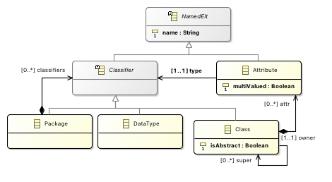
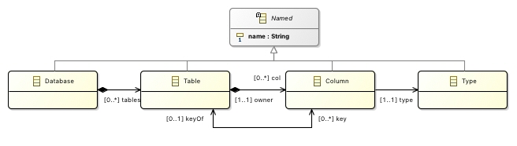
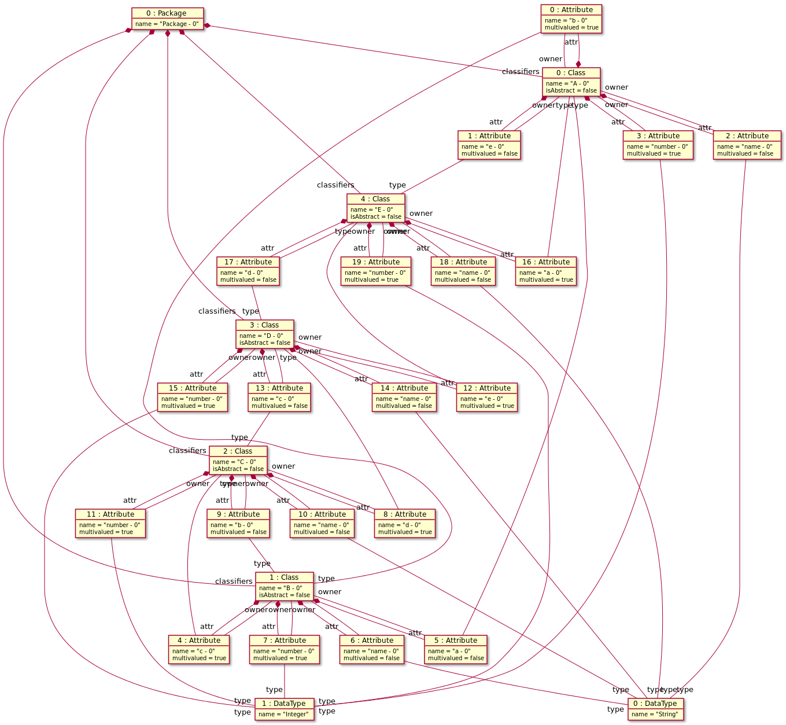
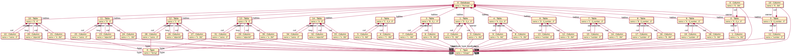

# FMA-ATL

## Case study: Class2Relational

This case study has been adapted from the ATL model-to-model transformation [Class2Relational](https://www.eclipse.org/atl/atlTransformations/#Class2Relational).

The files used to run experiments can be found for ATL and for FMA-ATL below.

### ATL

The experiment was run with ATL 3.6 (regular).

#### Metamodels: 
* Source: [Extended Class metamodel (ecore)](atl/metamodels/Class.ecore)

* Target: [Extended Relational metamodel (ecore)](atl/metamodels/Relational.ecore)

#### Models:

| #Model size | #Packages | #Classes | #Attributes | xmi  |
|-------------|-----------|----------|-------------|------|
| 26 | 1 | 5 | 20 | [model00001.xmi](./atl/inputModels/inputModel-00001.xmi) | 
| 650 | 25 | 125 | 500 | [model00025.xmi](./atl/inputModels/inputModel-00025.xmi) |
| 1300 | 50 | 250 | 1000 | [model00050.xmi](./atl/inputModels/inputModel-00050.xmi) |
| 1950 | 75 | 375 | 1500 | [model00075.xmi](./atl/inputModels/inputModel-00075.xmi) |
| 2600 | 100 | 500 | 2000 | [model00100.xmi](./atl/inputModels/inputModel-00100.xmi) |
| 3900 | 150 | 750 | 3000 | [model00150.xmi](./atl/inputModels/inputModel-00150.xmi) |
| 5200 | 200 | 1000 | 4000 | [model00200.xmi](./atl/inputModels/inputModel-00200.xmi) |
| 6500 | 250 | 1250 | 5000 | [model00250.xmi](./atl/inputModels/inputModel-00250.xmi) |
| 10400 | 400 | 2000 | 8000 | [model00400.xmi](./atl/inputModels/inputModel-00400.xmi) |
| 13000 | 500 | 2500 | 10000 | [model00500.xmi](./atl/inputModels/inputModel-00500.xmi) |
| 26000 | 1000 | 5000 | 20000 | [model01000.xmi](./atl/inputModels/inputModel-01000.xmi) |
| 52000 | 2000 | 10000 | 40000 | [model02000.xmi](./atl/inputModels/inputModel-02000.xmi) |
| 78000 | 3000 | 15000 | 60000 | [model03000.xmi](./atl/inputModels/inputModel-03000.xmi) |

* Input model 00001:

* Output model 00001:

#### Atl transformations
* [Version with matched rules only](atl/atlFiles/Package2Database_ResolveTemp.atl)
* [Version with lazy rules](atl/atlFiles/Package2Database_Lazy.atl)

## FMA-ATL

The experiment was run with Maude 2.6.

### FMA-ATL (with matched rules only - no lazy rules)

| #Model size | #Packages | #Classes | #Attributes | xmi  |
|-------------|-----------|----------|-------------|------|
| 26 | 1 | 5 | 20 | [model00001.maude](./fma-atl/test/modules/MetricsPreludeChanged_pk2db_ResolveTemp_00001.maude) | 
| 650 | 25 | 125 | 500 | [model00025.maude](./fma-atl/test/modules/MetricsPreludeChanged_pk2db_ResolveTemp_00025.maude) |
| 1300 | 50 | 250 | 1000 | [model00050.maude](./fma-atl/test/modules/MetricsPreludeChanged_pk2db_ResolveTemp_00050.maude) |
| 1950 | 75 | 375 | 1500 | [model00075.maude](./fma-atl/test/modules/MetricsPreludeChanged_pk2db_ResolveTemp_00075.maude) |
| 2600 | 100 | 500 | 2000 | [model00100.maude](./fma-atl/test/modules/MetricsPreludeChanged_pk2db_ResolveTemp_00100.maude) |
| 3900 | 150 | 750 | 3000 | [model00150.maude](./fma-atl/test/modules/MetricsPreludeChanged_pk2db_ResolveTemp_00150.maude) |
| 5200 | 200 | 1000 | 4000 | [model00200.maude](./fma-atl/test/modules/MetricsPreludeChanged_pk2db_ResolveTemp_00200.maude) |
| 6500 | 250 | 1250 | 5000 | [model00250.maude](./fma-atl/test/modules/MetricsPreludeChanged_pk2db_ResolveTemp_00250.maude) |
| 10400 | 400 | 2000 | 8000 | [model00400.maude](./fma-atl/test/modules/MetricsPreludeChanged_pk2db_ResolveTemp_00400.maude) |
| 13000 | 500 | 2500 | 10000 | [model00500.maude](./fma-atl/test/modules/MetricsPreludeChanged_pk2db_ResolveTemp_00500.maude) |
| 26000 | 1000 | 5000 | 20000 | [model01000.maude](./fma-atl/test/modules/MetricsPreludeChanged_pk2db_ResolveTemp_01000.maude) |
| 52000 | 2000 | 10000 | 40000 | [model02000.maude](./fma-atl/test/modules/MetricsPreludeChanged_pk2db_ResolveTemp_02000.maude) |
| 78000 | 3000 | 15000 | 60000 | [model03000.maude](./fma-atl/test/modules/MetricsPreludeChanged_pk2db_ResolveTemp_03000.maude) |

### FMA-ATL (with lazy rules)

| #Model size | #Packages | #Classes | #Attributes | xmi  |
|-------------|-----------|----------|-------------|------|
| 26 | 1 | 5 | 20 | [model00001.maude](./fma-atl/test/modules/MetricsPreludeChanged_pk2db_Lazy_00001.maude) | 
| 650 | 25 | 125 | 500 | [model00025.maude](./fma-atl/test/modules/MetricsPreludeChanged_pk2db_Lazy_00025.maude) |
| 1300 | 50 | 250 | 1000 | [model00050.maude](./fma-atl/test/modules/MetricsPreludeChanged_pk2db_Lazy_00050.maude) |
| 1950 | 75 | 375 | 1500 | [model00075.maude](./fma-atl/test/modules/MetricsPreludeChanged_pk2db_Lazy_00075.maude) |
| 2600 | 100 | 500 | 2000 | [model00100.maude](./fma-atl/test/modules/MetricsPreludeChanged_pk2db_Lazy_00100.maude) |
| 3900 | 150 | 750 | 3000 | [model00150.maude](./fma-atl/test/modules/MetricsPreludeChanged_pk2db_Lazy_00150.maude) |
| 5200 | 200 | 1000 | 4000 | [model00200.maude](./fma-atl/test/modules/MetricsPreludeChanged_pk2db_Lazy_00200.maude) |
| 6500 | 250 | 1250 | 5000 | [model00250.maude](./fma-atl/test/modules/MetricsPreludeChanged_pk2db_Lazy_00250.maude) |
| 10400 | 400 | 2000 | 8000 | [model00400.maude](./fma-atl/test/modules/MetricsPreludeChanged_pk2db_Lazy_00400.maude) |
| 13000 | 500 | 2500 | 10000 | [model00500.maude](./fma-atl/test/modules/MetricsPreludeChanged_pk2db_Lazy_00500.maude) |
| 26000 | 1000 | 5000 | 20000 | [model01000.maude](./fma-atl/test/modules/MetricsPreludeChanged_pk2db_Lazy_01000.maude) |
| 52000 | 2000 | 10000 | 40000 | [model02000.maude](./fma-atl/test/modules/MetricsPreludeChanged_pk2db_Lazy_02000.maude) |
| 78000 | 3000 | 15000 | 60000 | [model03000.maude](./fma-atl/test/modules/MetricsPreludeChanged_pk2db_Lazy_03000.maude) |
